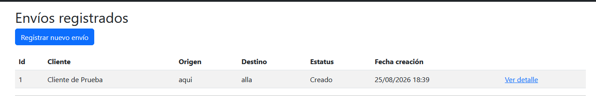
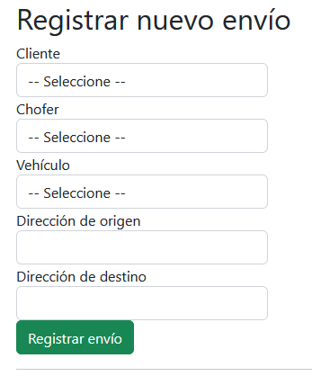
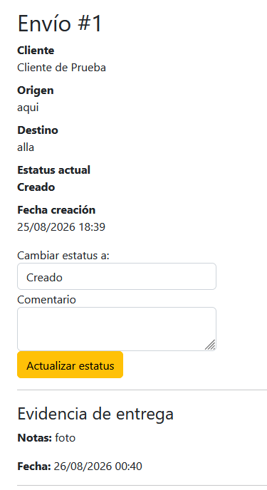
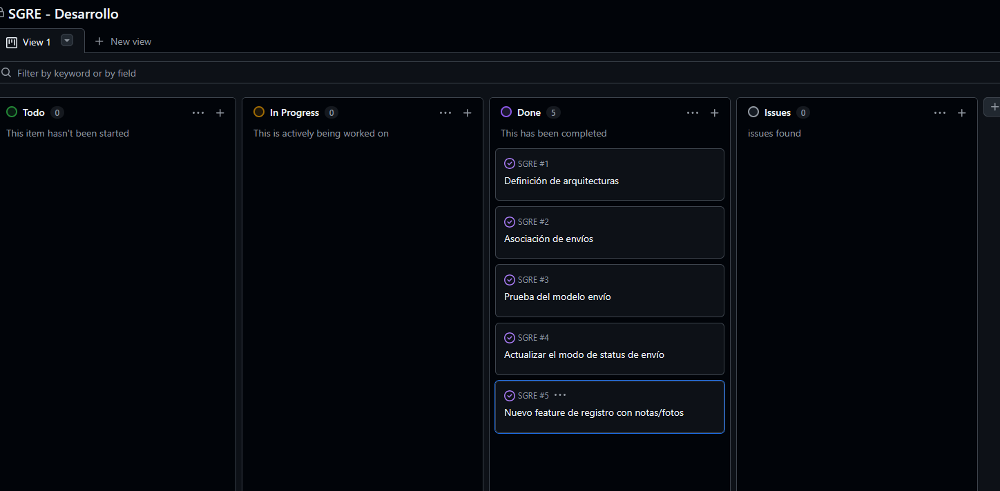
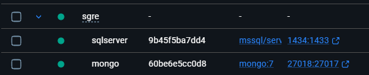

# SGRE — Sistema de Gestión y Rastreo de Envíos Logísticos

Prototipo desarrollado como parte de la postulación al puesto de Desarrollador en **GRIVER**, aplicando las tecnologías y prácticas solicitadas en la vacante sobre un caso de uso real del giro logístico: registro, seguimiento y evidencia de entrega de envíos.

---

## Tabla de contenido

- [Objetivo del proyecto](#objetivo-del-proyecto)
- [Stack tecnológico](#stack-tecnológico)
- [Arquitectura](#arquitectura)
- [Modelo de datos](#modelo-de-datos)
- [Requisitos previos](#requisitos-previos)
- [Instalación y ejecución local](#instalación-y-ejecución-local)
- [Ejecución con Docker](#ejecución-con-docker)
- [Pruebas unitarias](#pruebas-unitarias)
- [Gestión ágil del proyecto](#gestión-ágil-del-proyecto)
- [Capturas de pantalla](#capturas-de-pantalla)
- [Mapeo de requisitos de la vacante](#mapeo-de-requisitos-de-la-vacante)

---

## Objetivo del proyecto

SGRE permite:
- Registrar clientes, choferes y vehículos.
- Crear envíos y asociarlos a un cliente, chofer y vehículo.
- Actualizar el estatus de un envío (`Creado` → `EnTransito` → `Entregado` / `Incidencia`) con historial de cambios.
- Registrar evidencia de entrega (notas, con soporte para fotos y firma) en una base de datos no relacional.

El objetivo del prototipo es demostrar buenas prácticas de ingeniería de software: **POO + SOLID, arquitectura en capas, pruebas unitarias, control de versiones y contenedores** — no solo que el sistema funcione, sino que esté construido de forma mantenible y profesional.

---

## Stack tecnológico

| Capa | Tecnología |
|---|---|
| Backend | C#, .NET Framework 4.7 |
| Frontend | ASP.NET MVC 5 + Razor |
| Base de datos relacional | SQL Server 2022/2025 |
| Base de datos no relacional | MongoDB |
| ORM | Entity Framework 6 (Code First + Migrations) |
| Inyección de dependencias | Unity |
| Pruebas unitarias | MSTest + Moq |
| Control de versiones | Git + GitHub |
| Contenedores | Docker (SQL Server y MongoDB en Linux) |
| Gestión ágil | Tablero Kanban (GitHub Projects) |

---

## Arquitectura

Arquitectura en capas (Clean Architecture simplificada), donde las dependencias siempre apuntan hacia el Domain:

```
        SGRE.Web  (ASP.NET MVC 5 + Razor)
       /         \
SGRE.Application  SGRE.Infrastructure  (EF6 / SQL Server, MongoDB.Driver)
       \         /
        SGRE.Domain  (Entidades, Enums, Documents, Interfaces)
              ↑
        SGRE.Tests  (MSTest + Moq)
```

- **SGRE.Domain**: entidades POCO, enums, documento de Mongo (`EvidenciaEntrega`) e interfaces de repositorio/servicio. No depende de ningún otro proyecto ni de ningún framework de persistencia.
- **SGRE.Application**: servicios de negocio (`EnvioService`, `ClienteService`, `ChoferService`, `VehiculoService`, `EvidenciaService`) que consumen las interfaces del Domain vía inyección de dependencias por constructor.
- **SGRE.Infrastructure**: implementación real de los repositorios con Entity Framework 6 (SQL Server) y MongoDB.Driver (evidencias).
- **SGRE.Web**: Controllers y Vistas Razor; resuelve las dependencias en tiempo de ejecución mediante Unity.
- **SGRE.Tests**: pruebas unitarias de la lógica de negocio, con los repositorios simulados mediante Moq.

### Principios SOLID aplicados

- **S**: cada servicio tiene una única responsabilidad de negocio (ej. `EnvioService` no sabe cómo se persisten los datos).
- **O**: `INotificador` permite agregar nuevos canales de notificación sin modificar `EnvioService`.
- **L**: cualquier implementación de `IRepositorioEnvio` (SQL Server o un mock de pruebas) es intercambiable sin romper el servicio.
- **I**: interfaces de repositorio segregadas por entidad (`IRepositorioCliente`, `IRepositorioEnvio`, etc.) en vez de una interfaz genérica sobrecargada.
- **D**: los Controllers y servicios dependen de abstracciones (interfaces del Domain), nunca de clases concretas de Infrastructure.

---

## Modelo de datos

### SQL Server (transaccional)

```
Cliente(Id, Nombre, RFC, Telefono, Direccion)
Vehiculo(Id, Placa, Tipo, Capacidad)
Chofer(Id, Nombre, Licencia, TelefonoEmergencia)
Envio(Id, ClienteId, ChoferId, VehiculoId, OrigenDireccion, DestinoDireccion,
      FechaCreacion, FechaEntregaEstimada, Estatus)
EstatusHistorial(Id, EnvioId, Estatus, FechaCambio, Comentario)
```

### MongoDB (evidencias de entrega)

```json
{
  "envioId": 1,
  "fecha": "2026-08-21T00:08:00",
  "fotosBase64": [],
  "firmaReceptorBase64": null,
  "notas": "Entregado en recepción, sin novedad",
  "latitud": null,
  "longitud": null
}
```

---

## Requisitos previos

- Visual Studio 2022/2026 con el workload **ASP.NET and web development** y el componente **.NET Framework 4.7/4.7.2 targeting pack**.
- SQL Server (local o en Docker).
- MongoDB (local o en Docker).
- Docker Desktop (opcional, para el modo contenerizado).

---

## Instalación y ejecución local

1. Clona el repositorio:
   ```bash
   git clone https://github.com/tu-usuario/SGRE.git
   ```
2. Abre `SGRE.sln` en Visual Studio.
3. Restaura los paquetes NuGet (Visual Studio lo hace automáticamente al compilar, o manualmente desde **Tools → NuGet Package Manager → Restore Packages**).
4. Configura el connection string de SQL Server en `SGRE.Web/Web.config`:
   ```xml
   <connectionStrings>
     <add name="SGREConnection"
          connectionString="Server=TU_SERVIDOR;Database=SGREDb;Trusted_Connection=True;MultipleActiveResultSets=true;TrustServerCertificate=True"
          providerName="System.Data.SqlClient" />
   </connectionStrings>
   ```
5. Configura MongoDB en `SGRE.Web/Web.config`:
   ```xml
   <appSettings>
     <add key="MongoConnectionString" value="mongodb://localhost:27017" />
     <add key="MongoDatabaseName" value="SGREDb_Evidencias" />
   </appSettings>
   ```
6. Genera la base de datos con Entity Framework 6 (Package Manager Console, proyecto por defecto `SGRE.Infrastructure`):
   ```powershell
   Update-Database -Verbose
   ```
7. Ejecuta el proyecto (`F5`). La aplicación abre en `/Envio` mostrando el listado.

---

## Ejecución con Docker

Las bases de datos (SQL Server y MongoDB) pueden ejecutarse en contenedores Linux para simular un entorno de despliegue reproducible, mientras la aplicación .NET Framework 4.7 corre en Windows (IIS Express) — esta combinación es la que permite usar Docker/Linux de forma realista con un framework que solo corre nativamente en Windows.

1. Levanta los contenedores:
   ```bash
   docker-compose up -d
   ```
2. Verifica que estén corriendo:
   ```bash
   docker ps
   ```
3. Ajusta el `Web.config` para apuntar a los puertos de los contenedores (ver `docker-compose.yml` para los puertos configurados) y ejecuta las migraciones de EF6 contra el contenedor.

> **Nota:** en Windows, usa `127.0.0.1` en lugar de `localhost` en los connection strings al conectar a los contenedores, para evitar conflictos de resolución IPv6/IPv4.

---

## Pruebas unitarias

El proyecto `SGRE.Tests` cubre la lógica de negocio de `EnvioService` usando MSTest y Moq, con los repositorios simulados (sin necesidad de base de datos real).

Casos cubiertos:
- Obtener un envío existente / inexistente (caso feliz y caso de error).
- Crear un envío y verificar que se registra su historial.
- Cambiar estatus a "Entregado" y verificar que se dispara la notificación.
- Cambiar a un estatus distinto de "Entregado" y verificar que **no** se notifica (caso límite).
- Intentar modificar un envío ya entregado y verificar que se lanza una excepción de regla de negocio.

Para ejecutarlas: **Test → Test Explorer → Run All Tests** en Visual Studio.

---

## Gestión ágil del proyecto

El desarrollo se organizó con un tablero Kanban en GitHub Projects, dividiendo el trabajo en historias de usuario con formato `Como / Quiero / Para`, movidas conforme se completaba cada capa de la arquitectura.

🔗 [Ver tablero del proyecto](https://github.com/tu-usuario/SGRE/projects)

---

## Capturas de pantalla

### Listado de envíos
_

### Registro de un nuevo envío
_

### Detalle de envío con historial de estatus y evidencia
_

### Tablero Kanban
_

### Contenedores Docker corriendo
_

> Sugerencia: crea la carpeta `docs/screenshots/` en la raíz del repo y coloca ahí las imágenes con esos nombres para que se muestren automáticamente en GitHub al reemplazar cada línea por ``.

---

## Mapeo de requisitos de la vacante

| Requisito | Cómo se cubre en este prototipo |
|---|---|
| POO y principios SOLID | Arquitectura en capas con inyección de dependencias e interfaces |
| C#, .NET Framework 4.7, Razor | Backend en .NET Framework 4.7, ASP.NET MVC 5 + Razor |
| SQL Server / MongoDB | SQL Server como base transaccional, MongoDB para evidencias de entrega |
| Git, Visual Studio/VS Code, Postman | Repositorio en GitHub, desarrollo en Visual Studio y VS Code |
| Aseguramiento de calidad | Pruebas unitarias con MSTest + Moq (casos felices, de error y límite) |
| Linux | SQL Server y MongoDB ejecutándose en contenedores Docker sobre Linux |
| Metodologías ágiles y gestión de tareas | Tablero Kanban en GitHub Projects con historias de usuario |

---

**Autor:** Sergio — Mechatronics Engineer, explorando oportunidades en automatización industrial y desarrollo de software.